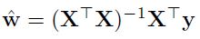
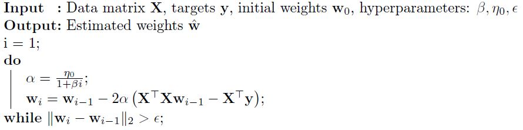

# Reddit Commnets Popularity 

In this project, we will predict a popularity score for Reddit comments using Linear Regression. The dataset is a collection of 
comments from **r/AskReddit** forum, which is a question-answering forum within Reddit. Since these comments are directly downloaded from 
Reddit, they may contain inappropriate and foul language.<br>
We conduct the Linear Regression using two approaches:
* **Closed-form solution**: <br><br>
* **Gradient descent**: Here is the algorithm to implement Gradient descent:<br><br>
 <br>
For evaluation, we use Mean Squared Error (MSE) and the time it takes to run each of the above approaches.

## Dataset
The dataset is a .json file of a NumPy list containing 12000 comments. Each comment is a dictionary with the following keys:
* **text**: the actual comment
* **controversiality**: This is a metric of how "controversial" a comment is. It is a proprietary metric
computed by Reddit and takes on binary values.
* **is_root**: A binary variable indicating whether this comment is the "root" comment of a discussion thread.
* **children**: This counts how many replies this comment recieved.
* **popularity_score**: The target score which we are trying to predict.
We split the dataset into Train/Validation/Test partitions. <br>
The dataset file is in the data folder.
## Preprocessing
As the comments are taken from real discussions, we need to remove irrelevant information (such as numbers, punctuations, etc.) 
from each comment. This increases the performance of the regressor.
## Getting Started
In order to run the code, you need to use a Python3 kernel in your Jupyter Notebook. 
### Prerequisites
Install the following packages: 
* Matplotlib
* json
* NumPy
### Experiment
Download the repository in your local computer. 
```
git clone https://github.com/PouriaCh/RedditComments.git
```
If all of the required packages are installed, you will have the results. 
## Acknowledgement
This project was done as part of the COMP551 (Applied Machine Learning) requirements in McGill University.
